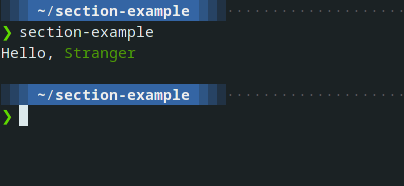
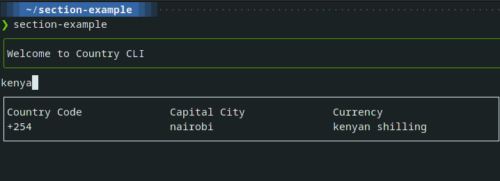

# Buiding CLI applications using React.js

Command-line applications have become popular in the developer ecosystem for several reasons.

One of the most common reasons is the ease of use.

Many essential developer tools are terminal applications or command Line applications because of the same reason.

As the complexity and functionality of the terminal applications grow, the more need for a simpler and easier way to create CLI applications.

In a [previous article](https://www.section.io/engineering-education/create-a-nodejs-cli/), we covered how to make a CLI application using Node.js.

One of the key takeaways from building a CLI using Node.js is that they are hard and tedious to make.

React makes it very easy to create powerful and very interactive CLI applications.

Let's create a CLI with React.js instead of Node.js and see the difference.

## Why React and not Node

React takes away all the pains of parsing arguments and does them in the background.

React also allows you to render components to the terminal like you would in a browser.

Ink allows you even to use flexbox, meaning no more using coloured string outputs like you would in Node.

To make a CLI using React, we use a library called [INK](https://github.com/vadimdemedes/ink) to make our work easier.

Some popular applications made with React and INK include.

- Jest
- Gatsby
- Prisma
- Typescript
- Twilio SIGNAL

## Getting Started with React INK

Ink is a React.js framework that abstracts the tedious task of building CLI applications.

Ink does not need any extra learning compared to Node. If you are familiar with React, then you are good to go.

Let's get started by building a simple Hello World application.

To do this, we need to React and Ink from npm. To make our work easier, Ink ships with a command to bootstrap a React CLI application.

In your terminal type

```terminal

mkdir section-example && cd section-example

npx create-ink-app
```
Warning: the last command might take some time.  
When it finishes, it will have created a link executable for the application.

When you run `section-example` (name of your application) in the terminal, it should return this:



And there you have it, your first CLI using React. To achieve this in Node.js would have taken a lot of code and time and not forgetting more libraries.

## Simple Project

Let's go ahead and work on a more complex project.

 The project will help you understand the elements and the project structure of React ink.

We will work in the `ui.js` file. The entry file for the application is `cli.js.`

the code should look something like this:

```javascript
"use strict";
const React = require("react");
const { Text } = require("ink");

const App = ({ name = "Stranger" }) => (
 <Text>
  Hello, <Text color="green">{name}</Text>
 </Text>
);

module.exports = App;
```

We are importing React from the React package.

On the second line, we are importing the Text element that ships with the ink package.

We also have a function that takes in a name and renders it.
Let's create a simple CLI application that takes a country as input.
 It then returns some information about the given country in a table.

To achieve this we need this npm package called [world-countries-capitals
](https://www.npmjs.com/package/world-countries-capitals), which will give us country information.

Let's start by getting user input. To achieve this, we need text input. Lucky for us, ink provides a package for this, just run:

`npm install ink-text-input`

In our `ui.js` let's import and use the text input in the terminal.

We will also make use of the `useState` React hook to store our country value and handle changes to the country name.

In simple terms, think of ```useState hooks```  as a way to work with variables in React.

To learn more about React hooks, I recommend reading the React [documentation](https://reactjs.org/docs/hooks-overview.html).

Our code now will look like this:

```javascript
"use strict";
const React = require("react");
const { Box } = require("ink");
const TextInput = require("ink-text-input").default;

const App = () => {
 const [country, setCountry] = React.useState("");

 return (
 <Box>
 <TextInput
 placeholder="Enter your country..."
 value={country}
 onChange={setCountry}
 />
 </Box>
 );
};

module.exports = App;
```

On running `section-example` in the terminal, you should be able to enter a country name.

Moving forward, we will need to search for the country in real-time and display the results in a table.

To do so, we will invoke the world countries npm package. We will use another React hook called `useEffect` to fetch our data and update the component as it renders.

Let's go ahead and do so.

We first install and import the package.

In the terminal:

``` terminal
    npm i world-countries-capitals
```

at the top of our file, we import the package

```javascript
const wcc = require("world-countries-capitals");
```

We will create some variables to hold the data we get from the useEffect hook, using the useState. They will come in handy when updating the table in real-time.

```javascript
const [capital, setCapital] = React.useState("");
const [currency, setCurrency] = React.useState("");
const [phone, setPhone] = React.useState("");
```

Finally, let's update our variables with information from the npm package.

Our complete ```useEffect``` hook, will look like this.

```javascript
React.useEffect(() => {
 const getCountry = wcc.getCountryDetailsByName(country);
 setCapital(getCountry[0].capital);
 setCurrency(getCountry[0].currency);
 setPhone(getCountry[0].phone_code);
 });
```

Our code at this time, will look like this, inclusive of the useEffect hook:

```javascript
"use strict";
const React = require("react");
const { Box } = require("ink");
const TextInput = require("ink-text-input").default;
const wcc = require("world-countries-capitals");

const App = () => {
 const [country, setCountry] = React.useState("");
 const [capital, setCapital] = React.useState("");
 const [currency, setCurrency] = React.useState("");
 const [phone, setPhone] = React.useState("");

 React.useEffect(() => {
 const getCountry = wcc.getCountryDetailsByName(country);
 setCapital(getCountry[0].capital);
 setCurrency(getCountry[0].currency);
 setPhone(getCountry[0].phone_code);
 });
 return (
 <Box>
 <TextInput
 placeholder="Enter your country..."
 value={country}
 onChange={setCountry}
 />
 </Box>
 );
};

module.exports = App;
```

Finally, let's render the information in a table.

We will need to nest a lot of boxes with some attributes. The most common attributes will be ```flex-direction``` and ```borderStyle```.

Since we are using React, we are still in the JSX realm, and we need a parent attribute.

Within the Box element, beneath the TextBox element, we will add our table.

``` javascript

<Box flexDirection="column" width={80} borderStyle="single">
 <Box>
 <Box width="40%">
 <Text>Country Code</Text>
 </Box>

 <Box width="40%">
 <Text>Capital City</Text>
 </Box>

 <Box width="40%">
 <Text>Currency</Text>
 </Box>
 </Box>
 <Box>
 <Box width="40%">
 <Text>{phone}</Text>
 </Box>

 <Box width="40%">
 <Text>{capital}</Text>
 </Box>

 <Box width="40%">
 <Text>{currency}</Text>
 </Box>
 </Box>
 </Box>
```

Let's add a banner to our application, just because we can. We will add it within the root Box element. We will add it on top of the text input.

```javascript
 <Box borderStyle="round" borderColor="green">
 <Text>Welcome to Country CLI</Text>
 </Box>
```

We are done. Our full code now looks like this:

```javascript
"use strict";
const React = require("react");
const { Text, Box } = require("ink");
const TextInput = require("ink-text-input").default;
const wcc = require("world-countries-capitals");

const App = () => {
 const [country, setCountry] = React.useState("");
 const [capital, setCapital] = React.useState("");
 const [currency, setCurrency] = React.useState("");
 const [phone, setPhone] = React.useState("");

 React.useEffect(() => {
 const getCountry = wcc.getCountryDetailsByName(country);
 setCapital(getCountry[0].capital);
 setCurrency(getCountry[0].currency);
 setPhone(getCountry[0].phone_code);
 });

 return (
 <Box flexDirection="column">
 <Box borderStyle="round" borderColor="green">
 <Text>Welcome to Country CLI</Text>
 </Box>
 <TextInput
 placeholder="Enter your country..."
 value={country}
 onChange={setCountry}
 />
 <Box flexDirection="column" width={80} borderStyle="single">
 <Box>
 <Box width="40%">
 <Text>Country Code</Text>
 </Box>

 <Box width="40%">
 <Text>Capital City</Text>
 </Box>

 <Box width="40%">
 <Text>Currency</Text>
 </Box>
 </Box>
 <Box>
 <Box width="40%">
 <Text>{phone}</Text>
 </Box>

 <Box width="40%">
 <Text>{capital}</Text>
 </Box>

 <Box width="40%">
 <Text>{currency}</Text>
 </Box>
 </Box>
 </Box>
 </Box>
 );
};

module.exports = App;

```

To test our new creation, we run ```section-example``` in our terminal, it should return this.



You can find a gif of the application in action [here](https://terminalizer.com/view/ad4a80d54380)

## Finishing Up

We just built our first complex CLI using React and here are Some things to note:

Ink comes with more elements that allow you to have more control over the user interface of the CLI.

It also ships with custom hooks to manipulate the data acquired from the terminal.
An example is, ```useInput``` that listens to the user input.

Creating CLI applications has never been easier using React ink. Go ahead and have fun building more complex and beautiful CLI applications.
To get the code used in the article, check [here](https://github.com/katungi/React-cli-section)
